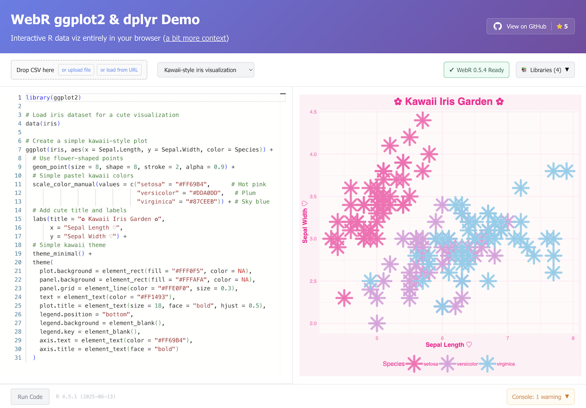

# WebR ggplot2 Demo

Interactive R data visualization in the browser using [WebR](https://webr.r-wasm.org/) (R in WebAssembly) and [ggplot2](https://ggplot2.tidyverse.org/) (the best charting library ever).



## What is it?

A web application that runs R code directly in your browser - no server required. Features live code editing, CSV upload, and interactive plots. Try it online at [quesmaorg.github.io/demo-webr-ggplot](https://quesmaorg.github.io/demo-webr-ggplot/).

For more context, see [our recent blog post on sandboxing AI-generated code](https://quesma.com/blog-detail/sandboxing-ai-generated-code-why-we-moved-from-webr-to-aws-lambda).

MIT License. Vibe-coded by [Piotr Migdał](https://p.migdal.pl/) from [Quesma](https://quesma.com/).

## Installation

Prerequisites:

- Node.js 18+
- [pnpm](https://pnpm.io/)

```bash
# Clone repository
git clone https://github.com/QuesmaOrg/demo-webr-ggplot.git
cd demo-webr-ggplot

# Install dependencies
pnpm install

# Start development server
pnpm dev

# Build for production
pnpm build
```

## Usage

1. Open http://localhost:5173 in your browser
2. Select an example or write your own R code
3. Upload CSV files via drag & drop
4. Click "Run Code" to execute

## Stack

- [WebR](https://webr.r-wasm.org/) - R in WebAssembly
- [Vue 3](https://vuejs.org/) + TypeScript
- [Vite](https://vitejs.dev/) - Build tool
- [Monaco Editor](https://microsoft.github.io/monaco-editor/) - Code editor
